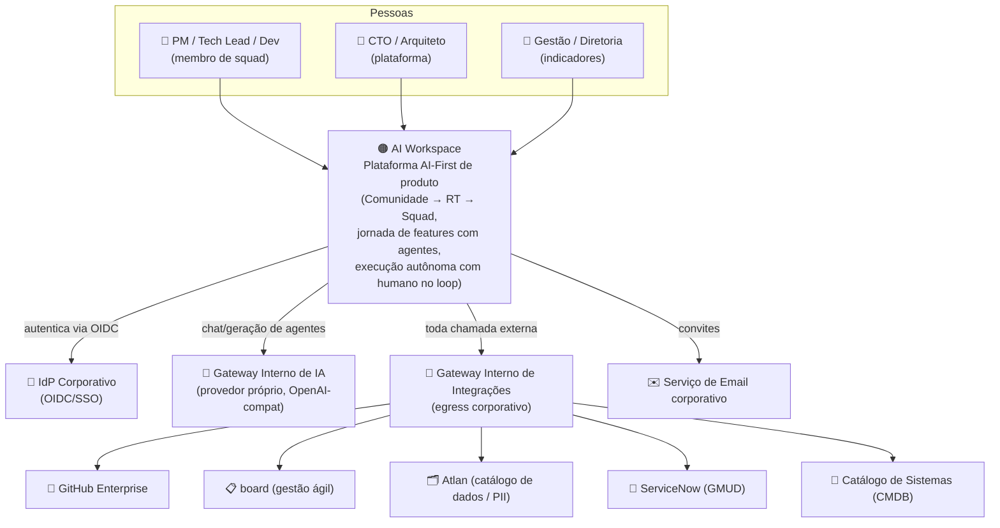
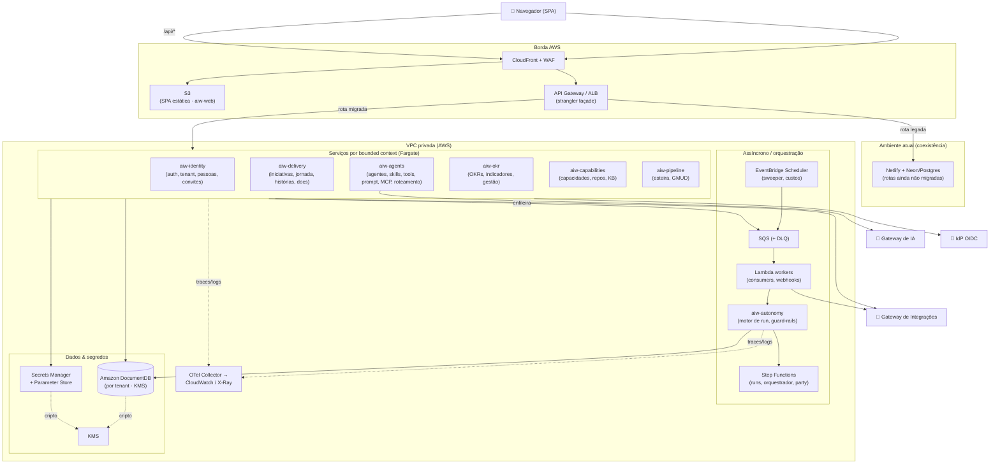
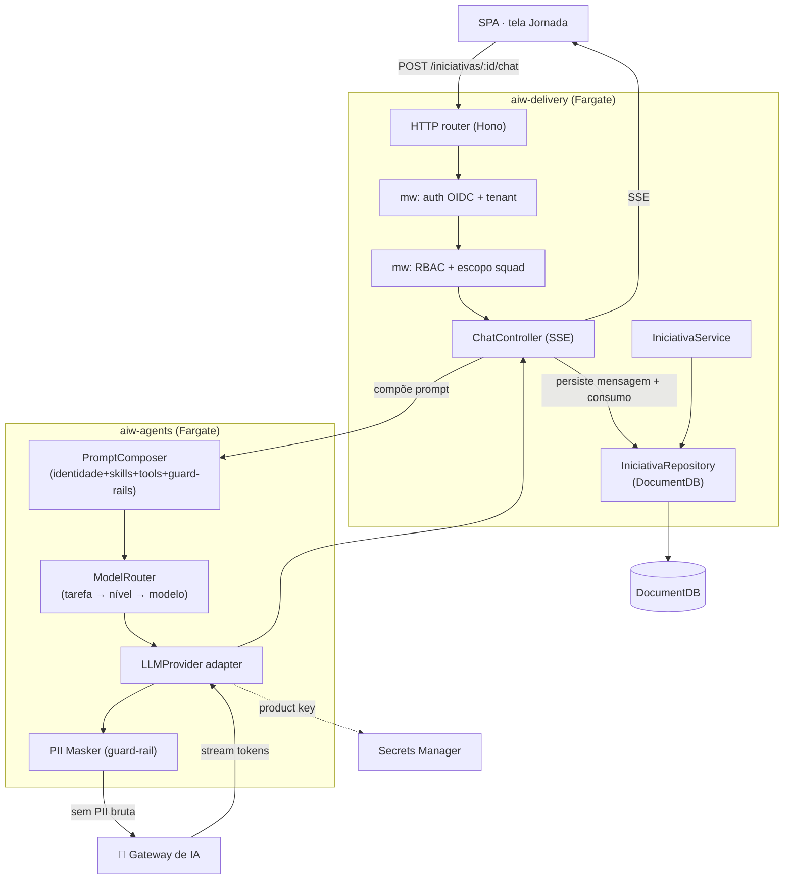
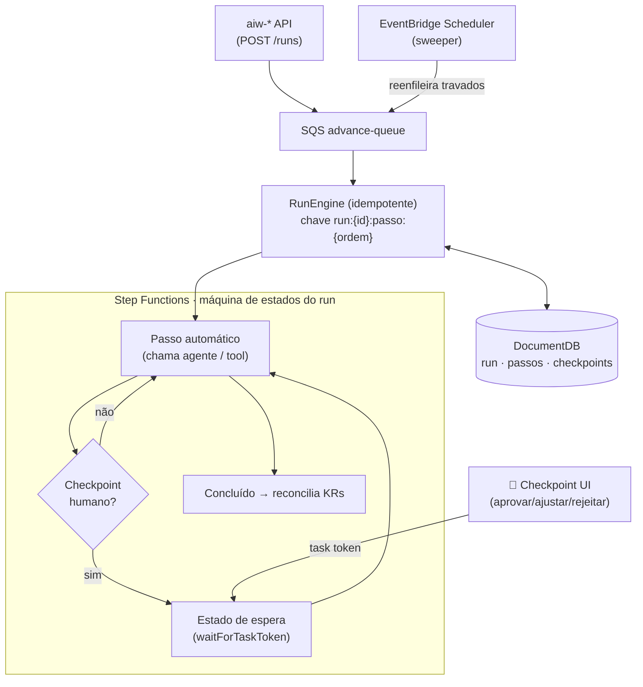
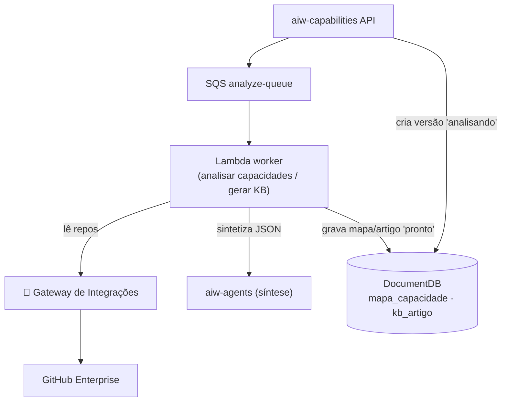
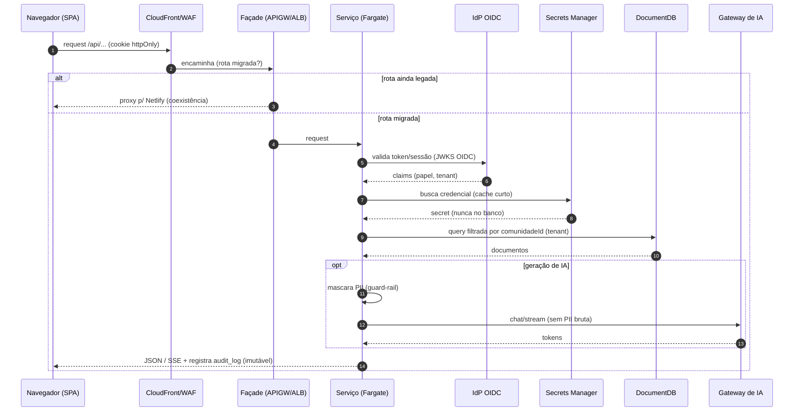

# Arquitetura da Aplicação — AI Workspace no destino AWS

| | |
|---|---|
| **Funcionalidade** | Visão de sistema (arquitetura de destino) |
| **Fase** | Entrega 1 |
| **Nível de maturidade** | N1 · Especificado |
| **Data** | 2026-07-17 |

> Destino corporativo (restrições inegociáveis): **multi-repo**, **AWS**,
> **MongoDB**, segurança/compliance de banco como requisito de primeira classe.
> As premissas foram fixadas no patamar **mais robusto** (o "caminho difícil"):
> Fargate+Lambda+Step Functions, **DocumentDB** como alvo de modelagem, egress por
> gateway interno, VPC privada, Secrets Manager, OIDC corporativo, OpenTelemetry e
> trilha de auditoria imutável. Onde uma opção mais simples é aceitável, ela é
> registrada como relaxação na ADR correspondente.

Este documento descreve a arquitetura em quatro visões: **C4 nível 1 (contexto)**,
**C4 nível 2 (container)**, **C4 nível 3 (componente)** para as funcionalidades
principais e o **fluxo de dados** (do request ao MongoDB, incluindo secrets e
auth). Cada bloco tem uma explicação em prosa: o que é, por que existe, com o que
fala.

---

## 1. C4 Nível 1 — Contexto

A aplicação vista de fora: quem usa e com quais sistemas externos ela conversa.

**Explicação.**

- **AI Workspace** é o sistema central: conduz o ciclo de produto (iniciativas,
  jornada com agentes, OKRs, KB, esteira/GMUD) e a execução autônoma da squad
  virtual. Existe para dar à diretoria uma forma AI-First de operar produto com
  governança e trilha de auditoria.
- **IdP Corporativo (OIDC/SSO)** — substitui o login OAuth GitHub / senha local do
  sistema atual. Existe porque, num banco, identidade e acesso são centralizados e
  auditáveis. O AI Workspace delega toda autenticação a ele.
- **Gateway Interno de IA** — ponto único de saída para o provedor de IA próprio.
  Existe para controlar custo, DLP (mascaramento de PII), quota e auditoria das
  chamadas de IA. O adapter `LLMProvider` do app aponta para ele — trocar de
  provedor muda só o gateway.
- **Gateway Interno de Integrações** — todo egress para sistemas externos (GitHub,
  board, Atlan, ServiceNow, CMDB) passa por aqui. Existe porque serviços em VPC
  privada não têm rota direta à internet; o gateway concentra allow-list,
  observabilidade e credenciais de serviço.
- **Sistemas externos** (GitHub, board, Atlan, ServiceNow, CMDB, Email) — as
  fronteiras que o produto já integra hoje, agora acessadas de forma controlada.

---

## 2. C4 Nível 2 — Containers

Os repositórios/serviços (multi-repo), os serviços AWS, o MongoDB e como se
conectam. Cada bounded context é um repositório e um serviço deployável de forma
independente — a unidade de migração do strangler fig.

**Explicação dos containers.**

- **aiw-web (S3 + CloudFront + WAF)** — a SPA React estática. Existe na borda para
  baixa latência e proteção (WAF). Fala com a API só via a façade.
- **Strangler façade (API Gateway / ALB)** — o roteador de borda que decide, por
  rota, se o request vai para um serviço novo na AWS ou é encaminhado ao ambiente
  **Netlify legado**. É o coração da coexistência: cada fatia migrada "rouba" suas
  rotas do legado (padrão strangler fig — ver ADR-004).
- **Serviços por bounded context (Fargate)** — cada um é um repositório e um
  container de longa duração. Fargate (não Lambda) para a API porque o produto usa
  **streaming SSE** (chat de agente) e respostas com latência de modelo; container
  persistente dá controle de conexão ao DocumentDB e ao streaming. Contextos:
  `aiw-identity`, `aiw-delivery`, `aiw-agents`, `aiw-okr`, `aiw-capabilities`,
  `aiw-pipeline`. Falam com o DocumentDB, o Secrets Manager, o IdP e os gateways.
- **Assíncrono/orquestração** — substitui as Background/Scheduled Functions da
  Netlify. **SQS (+DLQ)** é a fila real (no lugar do `fetch` interno);
  **Lambda workers** consomem a fila e tratam webhooks; **Step Functions** roda as
  máquinas de estado longas (execução autônoma, orquestrador, party) com
  checkpoints humanos como estados de espera que não custam computação;
  **EventBridge Scheduler** dispara o sweeper e o fechamento de custos.
  `aiw-autonomy` guarda o motor de run idempotente e os guard-rails.
- **Amazon DocumentDB** — o banco de documentos, dentro da VPC, criptografado por
  **KMS**, isolado por tenant (`comunidadeId`). Alvo de modelagem por ser a
  restrição mais dura (subconjunto de recursos) — o modelo que roda nele roda
  também em Atlas (ver ADR-003).
- **Secrets Manager + Parameter Store + KMS** — todas as credenciais fora do banco
  e do bundle. Encerra o antipadrão atual de token em coluna.
- **OTel Collector → CloudWatch / X-Ray** — observabilidade unificada
  (logs JSON, métricas, tracing) correlacionada por `requestId`/`runId`.
- **aiw-contracts / aiw-platform-infra / aiw-docs** (não mostrados no fluxo) — o
  repositório de contratos (OpenAPI + JSON Schema de eventos), a IaC (Terraform) e
  a documentação de arquitetura (este repositório).

---

## 3. C4 Nível 3 — Componentes (funcionalidades principais)

### 3.1 Jornada da iniciativa + chat do agente (streaming) — `aiw-delivery` + `aiw-agents`

O coração de valor e o esqueleto andante da nova stack (ver estratégia, Fase 1).

**Explicação.** A tela chama a rota de chat; middlewares validam sessão OIDC,
tenant e escopo de squad. O `ChatController` pede ao `aiw-agents` a composição do
prompt de sistema (identidade do agente + skills + tools + guard-rails herdados) e
o modelo resolvido pela tarefa. O `LLMProvider` chama o **gateway de IA** —
sempre passando pelo **PII Masker** (nunca envia PII bruta). Os tokens voltam em
stream e são repassados ao browser por **SSE** (o motivo de a API rodar em
Fargate). Ao encerrar, persiste a mensagem e o consumo de tokens no DocumentDB.

### 3.2 Execução autônoma (squad virtual) — `aiw-autonomy` + Step Functions

**Explicação.** Iniciar um run enfileira no SQS; o `RunEngine` (idempotente,
chave `run:{id}:passo:{ordem}`) avança passos automáticos. Em vez de um laço com
orçamento de tempo dentro de uma Background Function de 15 min, a orquestração vira
**Step Functions**: cada passo é uma tarefa; o **checkpoint humano** é um estado
`waitForTaskToken` — espera a decisão sem custar computação (a mesma "pausa
gratuita" do modelo atual, agora nativa). O **EventBridge Scheduler** roda o
sweeper que reenfileira runs presos. Estado e trilha vivem no DocumentDB.

### 3.3 Mapa de capacidades / KB por repositório — `aiw-capabilities` + jobs

**Explicação.** Trabalho longo e I/O-bound (ler muitos arquivos de repositório +
síntese por IA). Roda como **Lambda worker** disparado por SQS; a leitura do GitHub
passa pelo **gateway de integrações**; a síntese usa o `aiw-agents`. O progresso é
persistido para a UI acompanhar (`status: analisando|pronto|erro`), como hoje.

---

## 4. Fluxo de dados (request → MongoDB, com secrets e auth)

**Explicação do fluxo.**

1. O browser envia o cookie de sessão `httpOnly`; **CloudFront + WAF** filtram na
   borda.
2. A **façade** decide, por rota, entre serviço novo (AWS) e legado (Netlify) —
   habilitando a migração incremental sem big-bang.
3. O serviço **valida a sessão contra o IdP OIDC** (JWKS), obtendo papel e tenant —
   identidade corporativa, não mais OAuth GitHub.
4. Credenciais vêm do **Secrets Manager** (cache curto em memória), **nunca do
   banco** — encerrando o antipadrão de token em coluna.
5. Toda query ao **DocumentDB** é **filtrada por `comunidadeId`** (isolamento
   multi-tenant), com criptografia KMS em repouso e field-level para PII.
6. Se houver geração de IA, a PII é **mascarada** antes de sair pelo **gateway de
   IA**.
7. A resposta volta como JSON ou SSE; ações sensíveis geram registro na **trilha
   de auditoria imutável**.

---

## 5. Decisões estruturais (índice de ADRs)

As decisões que sustentam esta arquitetura estão registradas em `docs/adr/`:

- **ADR-001** — Multi-repo por bounded context + repositório de contratos
- **ADR-002** — Compute: Fargate + Lambda + Step Functions (híbrido robusto)
- **ADR-003** — Banco: Amazon DocumentDB como alvo de modelagem (Atlas como relaxação)
- **ADR-004** — Migração strangler fig com façade de borda
- **ADR-005** — Execução autônoma em Step Functions + DocumentDB (idempotência)
- **ADR-006** — Autenticação corporativa OIDC/SSO
- **ADR-007** — Secrets Manager + IAM least-privilege + VPC (fim do token em banco)
- **ADR-008** — Gateways internos de IA e de integrações (egress controlado)
- **ADR-009** — Observabilidade OpenTelemetry + CloudWatch + X-Ray
- **ADR-010** — PII/LGPD: mascaramento, tokenização, KMS e trilha imutável
- **ADR-011** — Documentação em repositório dedicado (`aiw-docs`) + híbrido
- **ADR-012** — Migração de dados Postgres→MongoDB por funcionalidade
