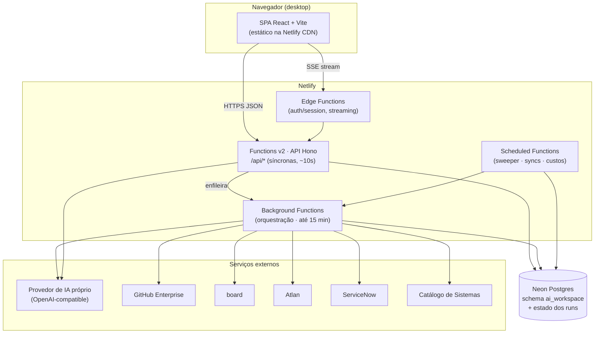

# AI Workspace — Especificação Técnica de Implementação

**Stack-alvo:** Netlify (frontend + serverless) · Neon (Postgres) · Provedor de IA próprio
**Versão do documento:** 1.0 · Julho/2026
**Status:** Proposta para implementação (MVP → produto completo)

---

## 1. Objetivo e escopo

Implementar a plataforma **AI Workspace** — o ambiente AI-First de produto da diretoria — a partir do protótipo navegável e do modelo de dados já validados. A plataforma cobre o ciclo completo: da estrutura organizacional (Comunidade → Release Train → Squad) e capacidades, passando pela jornada de features com agentes (método BMAD e plugáveis), documentação, base de conhecimento, OKRs, até a **execução autônoma da squad virtual** com humano no loop.

Esta especificação descreve **como construir** isso com uma stack deliberadamente enxuta e serverless: **Netlify** para hospedagem e computação, **Neon** para o banco Postgres, e o **provedor de IA próprio** da empresa por trás de uma camada de adaptação.

### Restrição de plataforma (premissa do projeto)

| Camada | Decisão | Observação |
|---|---|---|
| Hospedagem web + API | **Netlify** (site estático + Functions) | Sem contêineres, sem Kubernetes, sem servidor persistente |
| Banco de dados | **Neon** (Postgres serverless) | Pode ser Neon direto ou via "Netlify DB" (Neon gerenciado pela Netlify) |
| Inteligência artificial | **Provedor próprio** | Acessado por um adapter; presume-se API compatível com o padrão OpenAI (`/chat/completions`) |
| Integrações (GitHub, board, Atlan, ServiceNow, Catálogo) | Adapters server-side (Functions) | Modeladas como *tools* com permissão |

> **Consequência arquitetural central:** não há processo de longa duração sempre ligado. Toda orquestração (inclusive a execução autônoma dos agentes) precisa ser modelada como **máquina de estados persistida no Neon**, avançada por **Background Functions** e um **Scheduled Function** de varredura. Os checkpoints humanos (human-in-the-loop) são, convenientemente, pausas naturais que não consomem computação enquanto aguardam.

---

## 2. Visão geral da arquitetura



**Fluxo em uma frase:** a SPA fala com uma API serverless (Hono em Netlify Functions) que lê/escreve no Neon; trabalhos longos (agentes, execução autônoma, sincronizações) rodam em Background Functions dirigidas por uma máquina de estados no próprio Neon; um Scheduled Function garante retomada e tarefas periódicas; a IA e as integrações são chamadas sempre do lado servidor.

---

## 3. Stack tecnológica

### 3.1 Frontend
- **React 18 + TypeScript + Vite** — SPA. O protótipo atual (HTML/CSS único) serve de referência visual 1:1; os tokens de design (laranja Acme `#EC7000`, cinzas, tipografia system-ui) viram variáveis CSS / config Tailwind.
- **React Router** para as rotas (espelham as telas do protótipo).
- **TanStack Query** (React Query) para data fetching, cache e revalidação.
- **Tailwind CSS** (com o design system extraído do protótipo) ou CSS Modules — recomendação: Tailwind com `theme.extend` carregando os tokens.
- **Estado local:** mínimo; a maior parte do estado é servidor (React Query). Zustand só se necessário para UI global.
- Build de saída **estático**, publicado na CDN da Netlify. Sem SSR necessário (app interno autenticado); se SEO/SSR virar requisito, migrar para Remix/React Router framework mode sem trocar de host.

### 3.2 Backend (API)
- **Netlify Functions v2** (runtime Node, TypeScript) com **[Hono](https://hono.dev)** como framework de roteamento: uma função *catch-all* `netlify/functions/api.ts` atende `/api/*`, com middlewares de auth, RBAC, validação e logging.
- **Zod** para validação de entrada/saída (schemas compartilhados com o frontend em `/shared`).
- **Drizzle ORM** para acesso ao Neon (tipagem end-to-end a partir do schema).
- Funções especializadas:
  - **Background Functions** (`*-background.ts`): orquestração de agentes e execução autônoma (até 15 min por invocação).
  - **Scheduled Functions** (cron): *sweeper* de runs travados, sincronizações periódicas (board, GitHub, catálogo), fechamento de janela de custos.
  - **Edge Function** opcional para o *handshake* de sessão e para *streaming* de chat próximo do usuário.

### 3.3 Banco de dados
- **Neon Postgres** — usa **exatamente o schema `ai_workspace`** já entregue e validado (44 tabelas + views).
- Driver **`@neondatabase/serverless`**:
  - **HTTP** (`neon()`) para queries pontuais (a maioria das rotas de leitura) — menor latência de conexão em cold start.
  - **WebSocket `Pool`** para transações multi-statement (ex.: criar iniciativa + etapas + histórias atomicamente).
- **String de conexão com pooler** (endpoint `-pooler`, PgBouncer em modo transaction) para suportar o alto volume de conexões curtas típico de serverless. Ver [Neon + Netlify Functions](https://neon.com/docs/guides/netlify-functions) e [driver serverless](https://neon.com/docs/serverless/serverless-driver).
- **Migrations** com `drizzle-kit`. O `ai_workspace_schema.sql` inicial pode ser aplicado como migration `0000_init`.
- **Neon branching** para bancos efêmeros por *deploy preview* (uma branch de banco por PR) — sinergia forte com os previews da Netlify.

### 3.4 Inteligência artificial
- **Adapter `LLMProvider`** isolando o provedor próprio atrás de uma interface estável (`chat()`, `stream()`, `embed()`), presumindo API compatível com OpenAI. Trocar de provedor = trocar só o adapter.
- **Roteador de modelos** que lê a tabela `modelo_ia_rota` (tarefa → nível de modelo → custo relativo) e escolhe o modelo por tipo de tarefa — é o mecanismo de "escalar barato".
- **Contabilização de tokens/custo** persistida em `consumo_tokens` (e por execução em `execucao_autonoma`).

---

## 4. Frontend — estrutura e rotas

### 4.0 Aproveitamento do protótipo (estratégia: reconstruir)

O protótipo navegável (`ai-workspace-prototipo.html`) é **referência de UX e design, não código de produção**. Ele é um arquivo único de HTML/CSS/JS com navegação simulada (troca de `display`, dados fixos, `toasts`) — ótimo para validar fluxo e visual, mas sem componentização, dados reais, tipagem ou autenticação. A estratégia adotada é **reconstruir tela a tela** em React, extraindo do protótipo tudo que é reutilizável e reescrevendo o que é lógica de aplicação.

**O que é reuso direto (copia/extrai do protótipo):**

- **Tokens de design** — o bloco `:root` do protótipo (cores `--accent:#EC7000`, `--ink`, `--line`, `--sidebar`, raios, sombras, tipografia system-ui) vira a fonte da verdade do `tailwind.config` (`theme.extend`) ou um `tokens.css`. É a primeira coisa a portar, pois todo componente depende dela.
- **Markup e estilos por componente** — cada padrão visual já existe no protótipo e é recortado para um componente React: `Chip`, `Card`, `KpiTile`, `Stepper` (jornada), `KrBar` (barra planejado×realizado), `Modal`, `Toast`, `Timeline` (execução autônoma), `AgentCard`, tabela de tools, `DocReader`, etc. Copie o HTML/CSS do padrão e parametrize por `props`.
- **Estrutura de navegação** — sidebar, topbar, breadcrumb de contexto (Comunidade › RT › Squad) e o mapa de telas viram o layout + as rotas da tabela abaixo.
- **Microcopy e rótulos** — textos, nomes de etapas, mensagens dos agentes e dos gates são reaproveitados como conteúdo/`i18n`.
- **Fluxos e estados de UI** — a sequência dos gates da execução autônoma, os checkpoints, os estados "no ritmo/atrás do plano" dos KRs: o protótipo já define o comportamento esperado; vira a especificação dos componentes.

**O que é reconstrução (reescreve do zero):**

- Toda a **lógica simulada** (funções `showPage`, `approveGate`, `openModal`, dados embutidos) é substituída por **React Router + componentes + React Query** consumindo a API real.
- **Dados fixos → dados do Neon** via os endpoints da seção 5.
- **Autenticação, RBAC e escopo** (inexistentes no protótipo) entram de verdade.
- **Acessibilidade e responsividade** revistas na portabilidade (foco, ARIA, teclado).

**Passo a passo sugerido:**

1. Extrair o `:root` do protótipo para `tokens.css` / `tailwind.config` e validar visualmente um botão + card idênticos ao protótipo.
2. Montar o **shell** (sidebar, topbar, layout de rotas) — é o "SPA shell com o design system do protótipo" da Fase 0.
3. Portar os **componentes base** (Chip, Card, Modal, Toast, KpiTile) uma vez; reusar em todas as telas.
4. Portar **tela a tela** na ordem das fases (seção 15), cada uma trocando os dados fixos pelos endpoints reais.
5. Manter o protótipo HTML no repositório como **referência viva** (`/docs/prototipo/`), para comparação pixel a pixel durante a portabilidade — sem ser servido em produção.

> Regra prática: se é **aparência ou fluxo**, reaproveite do protótipo; se é **comportamento com dados, permissão ou IA**, reconstrua. Nenhuma parte do arquivo HTML monolítico é publicada como está.

### 4.1 Rotas

Rotas espelhando o protótipo (todas atrás de autenticação, exceto `/login`):

| Rota | Tela | Papel típico |
|---|---|---|
| `/login` | Login GitHub / SSO | — |
| `/` | Seletor de visão (ou redirect por papel) | todos |
| `/squad/iniciativas` | Iniciativas da squad | pm, dev |
| `/squad/iniciativas/:codigo` | Jornada da iniciativa (brief→GMUD) | pm, dev |
| `/squad/okrs` | OKRs (cascata, planejado×realizado) | pm |
| `/squad/autonoma` | Execução autônoma (squad virtual) | pm |
| `/squad/capacidades` | Capacidades + repositórios (GitHub) | pm, dev |
| `/squad/dev` | Estação dev | dev |
| `/squad/docs` · `/squad/docs/:id` | Documentação + leitor | pm, dev |
| `/squad/kb` · `/squad/kb/:id` | Base de conhecimento | todos |
| `/squad/esteira` | Esteira & GMUDs | pm, dev |
| `/comunidade` | Estrutura / docs / sistemas / KB (consulta) | todos |
| `/console/*` | Console da plataforma (blueprints, esteira, métodos, agentes, MCPs) | arquiteto |
| `/console/agentes` · `/console/agentes/:id` | Agentes, Skills & Tools + editor | arquiteto |
| `/gestao/*` | Indicadores, docs das features, docs da comunidade | diretor, gerente, coordenador |

**Direcionamento por papel:** após o login, `pessoa.papel` decide o destino inicial (dev/pm → squad; arquiteto → console; diretor/gerente/coordenador → gestão). O seletor de visão só aparece para quem tem acesso a mais de um contexto.

---

## 5. Backend — API serverless

### 5.1 Padrão de roteamento (Hono numa Function)

```ts
// netlify/functions/api.ts
import { Hono } from "hono";
import { handle } from "hono/netlify";
import { auth } from "./_mw/auth";
import { rbac } from "./_mw/rbac";
import okrs from "./_routes/okrs";
import runs from "./_routes/runs";

const app = new Hono().basePath("/api");
app.use("*", auth);              // valida sessão (cookie httpOnly)
app.route("/okrs", okrs);
app.route("/runs", runs);
// ...

export default handle(app);
export const config = { path: "/api/*" };
```

### 5.2 Endpoints principais (REST/RPC)

| Método + rota | Descrição | Autorização |
|---|---|---|
| `POST /api/auth/github/callback` | Troca `code` por token, cria sessão | pública |
| `GET /api/me` | Usuário, papel, squad, escopos | sessão |
| `GET /api/squads/:id/iniciativas` | Lista features da squad | escopo squad |
| `POST /api/iniciativas` | Cria iniciativa (a partir de capacidade) | pm da squad |
| `GET /api/iniciativas/:codigo` | Jornada + etapas + histórias + repos | escopo |
| `POST /api/iniciativas/:id/chat` | **Chat com o agente da etapa (streaming)** | escopo |
| `GET /api/okrs?escopo=&squad=` | OKRs em cascata | escopo |
| `POST /api/krs/:id/medicoes` | Imputar planejado/realizado | pm |
| `POST /api/krs/:id/features` | Associar feature a KR | pm |
| `POST /api/repos/conectar` | Importar repo do GitHub + associar | pm/dev |
| `GET /api/docs` · `POST /api/docs` | Documentação | escopo |
| `GET /api/kb?escopo=` · `POST /api/kb` | KB (publicar por escopo) | autor |
| `POST /api/kb/:id/endossar` | Endosso RT/comunidade | arquiteto/RTE |
| `GET /api/console/agentes` · `PUT /api/agentes/:id` | Gerir agentes/skills/tools | arquiteto |
| `POST /api/runs` | **Iniciar execução autônoma** (OKR/KR alvo) | pm |
| `GET /api/runs/:id` | Estado do run + passos + checkpoints | escopo |
| `POST /api/runs/:id/checkpoints/:cid` | **Decidir checkpoint** (aprovar/ajustar/rejeitar) | pm |

**Streaming de chat:** rotas de chat retornam `text/event-stream` via `ReadableStream` (Functions v2 suportam streaming de resposta). O adapter de IA transmite tokens conforme chegam do provedor próprio; a função persiste a mensagem final e o consumo de tokens ao encerrar.

### 5.3 Limites operacionais das Functions (fonte: Netlify)

| Tipo de função | Duração | Uso no AI Workspace |
|---|---|---|
| Síncrona (Functions v2) | ~10s padrão (mais em planos pagos) | CRUD, leituras, disparo de jobs |
| **Streaming** | resposta em stream dentro do limite | chat com agentes |
| **Background** | **até 15 min**, resposta `202` imediata, sem streaming, *retry* automático (1 min, 2 min) | passos automáticos da execução autônoma, geração de docs, sync pesado |
| **Scheduled** (cron) | como síncrona, disparo agendado | sweeper de runs, sincronizações, custos |

Referências: [Background Functions](https://docs.netlify.com/build/functions/background-functions/), [Scheduled Functions](https://docs.netlify.com/build/functions/scheduled-functions/), [Functions API](https://docs.netlify.com/build/functions/api/).

---

## 6. Autenticação e autorização

### 6.1 Login via GitHub (OAuth)
1. SPA redireciona para o GitHub OAuth (org `acme-meios-pagamento`, escopos mínimos: `read:user`, `read:org`, e os necessários às tools de repositório).
2. Callback numa Function troca `code` por access token, resolve o usuário, faz *upsert* em `pessoa` (por e-mail/login) e cria uma **sessão**.
3. **Sessão** = cookie `httpOnly`, `Secure`, `SameSite=Lax`, contendo um **JWT assinado** (curto, ~15 min) + *refresh* opaco persistido no Neon (`sessao`). Alternativa gerenciada: **Auth.js** ou **Lucia**.
4. **SSO corporativo (Azure AD)** como provedor alternativo pelo mesmo mecanismo (OIDC).

> O access token do GitHub do usuário **não** é usado diretamente pelos agentes. As *tools* de repositório usam uma credencial de serviço (GitHub App instalada na org), com escopo controlado — assim a automação não depende da sessão de uma pessoa e é auditável.

### 6.2 Autorização (RBAC + escopo)
- **Papel** (`pessoa.papel`) define o que a pessoa pode fazer (criar na squad, endossar, configurar plataforma, ver gestão).
- **Escopo** (squad / release_train / comunidade) define o que ela enxerga e onde pode escrever. Regra central já modelada no protótipo: **cria/edita só na própria squad; consulta o resto**.
- Middleware `rbac(acao, escopoAlvo)` valida em toda rota de escrita. Nunca confiar no cliente — o guard-rail é servidor.
- Opcional: **RLS (Row-Level Security)** no Neon por `squad_id`/escopo, com `SET app.current_user`/`current_squad` por request, como defesa em profundidade.

---

## 7. Camada de IA (provedor próprio)

### 7.1 Interface do adapter

```ts
export interface LLMProvider {
  chat(req: ChatRequest): Promise<ChatResponse>;
  stream(req: ChatRequest): AsyncIterable<ChatChunk>;
  embed(texts: string[]): Promise<number[][]>;
}

export interface ChatRequest {
  model: string;                 // resolvido pelo roteador
  system: string;                // prompt de sistema do agente (identidade+skills+tools)
  messages: Message[];
  tools?: ToolSpec[];            // function-calling para as Tools da plataforma
  maxTokens?: number;            // teto do agente
  temperature?: number;
}
```

- Implementação `OwnProvider` aponta para o **endpoint do provedor próprio** (`AI_BASE_URL`) com `AI_API_KEY`, assumindo contrato OpenAI-compatible. Se o contrato for diferente, só o `OwnProvider` muda.
- **Roteador de modelos:** `resolveModel(tipoTarefa)` consulta `modelo_ia_rota`. Ex.: arquitetura/PRD → modelo avançado; histórias/resumos → intermediário; classificação/sync → leve.
- **Function calling → Tools:** as *tools* do agente (tabela `tool`, ligadas a MCP) viram `ToolSpec` para o modelo. Quando o modelo chama uma tool, a Function executa o **adapter da integração** correspondente, respeitando o `permissao_tool` (leitura/escrita/crítica). Ação **crítica** nunca executa sem checkpoint humano.

### 7.2 Contabilização de custo
Cada chamada registra `prompt_tokens`/`completion_tokens`. Um agregador (no fim da request ou no Scheduled Function) consolida em `consumo_tokens` (por squad/mês) e em `execucao_autonoma` (por run), aplicando o custo relativo do modelo. Alertas em 80% do budget da squad.

### 7.3 Composição do prompt de sistema
Montado a partir de `agente` (personalidade), `agente_skill` (skills → instruções) e `agente_tool` (tools disponíveis) + guard-rails herdados da plataforma. É exatamente o "Prompt de sistema (gerado)" do editor de agente no protótipo.

---

## 8. Orquestração de agentes e execução autônoma

O coração técnico. Como não há worker sempre ligado, a execução autônoma é uma **máquina de estados persistida** (`execucao_autonoma`, `execucao_passo`, `execucao_checkpoint`).

### 8.1 Máquina de estados

```
em_andamento ──(passo automático)──► em_andamento
     │
     ├─(chega num checkpoint_humano)─► aguardando_aprovacao   [SEM computação; espera decisão]
     │                                        │
     │              aprovar ◄─────────────────┤
     │              ajustar / rejeitar ───────► pausada / rejeitada
     ▼
 concluida
```

### 8.2 Motor de avanço (`advanceRun`)
Um **Background Function** (`run-advance-background.ts`) recebe um `runId` e executa em laço:
1. Carrega o run e o próximo passo `pendente`.
2. Se o passo é **automático**, executa a lógica do passo (chamar agente, mapear repos consultando `capacidade_repositorio`/catálogo, gerar documento, criar backlog no board…), grava `saida`/`status = concluido`, e segue para o próximo — **enquanto houver orçamento de tempo** (< ~13 min; margem sob o teto de 15).
3. Se o passo é **checkpoint humano**, cria/ativa `execucao_checkpoint`, seta o run em `aguardando_aprovacao` e **encerra** (a espera não custa computação).
4. Se estourar o tempo antes de terminar, apenas retorna; o **Scheduled Function sweeper** reenfileira o run para continuar (idempotência garante que passos já concluídos não repetem).

### 8.3 Retomada por decisão humana
`POST /api/runs/:id/checkpoints/:cid` grava a decisão (`aprovado`/`ajustar`/`rejeitado`), o `aprovador_id` e `decidido_em`; se aprovado, marca o passo como `aprovado` e **enfileira novamente** o `run-advance-background` para seguir. Ajustar/rejeitar leva a `pausada`/`rejeitada` (ou reabre o passo de decisão).

### 8.4 Idempotência e confiabilidade
- Cada passo tem `UNIQUE (execucao_id, ordem)` e é executado com verificação de estado — reprocessar é seguro (o *retry* automático das Background Functions exige isso).
- Efeitos externos (abrir PR, criar história, abrir GMUD) usam **chave de idempotência** (ex.: `run:{id}:passo:{ordem}`) para não duplicar — o mesmo princípio do KB de idempotência do próprio produto.
- Toda ação de escrita/crítica de agente respeita os **guard-rails** (`guard_rail` + flags do `agente`): nunca faz merge, não abre GMUD sem aprovação, teto de tokens por execução.

### 8.5 Chat interativo dos agentes (jornada)
Diferente do run autônomo: é síncrono/streaming. A Function monta o prompt do agente da etapa, faz `provider.stream()` e transmite via SSE; ao encerrar, persiste a mensagem e o consumo. Ferramentas de leitura podem ser chamadas inline; ações de escrita pedem confirmação na UI.

---

## 9. Integrações (Tools ↔ MCP)

Cada *tool* do catálogo (`tool`, com `permissao` e `conexao_mcp`) é implementada por um **adapter server-side** com interface comum:

```ts
export interface ToolExecutor {
  name: string;
  permission: "leitura" | "escrita" | "critica";
  execute(input: unknown, ctx: ExecCtx): Promise<ToolResult>;
}
```

| Tool | Integração | Implementação | Permissão |
|---|---|---|---|
| Ler repositório | GitHub Enterprise | GitHub App (Octokit) | leitura |
| Abrir Pull Request | GitHub Enterprise | Octokit (cria branch/PR, **nunca merge**) | escrita |
| Consultar metadados | Atlan | API REST Atlan | leitura |
| Sincronizar histórias | board | API board (webhook bidirecional) | escrita |
| Buscar sistema (sigla) | Catálogo de Sistemas (CMDB) | API do catálogo | leitura |
| Abrir GMUD | ServiceNow | Table/Import API | **crítica** (exige checkpoint) |
| Publicar documentação | Repositório de conhecimento (Neon/Git) | interno | escrita |

- **Enforcement de permissão:** o executor só roda se a tool estiver liberada para o agente (`agente_tool`) e o `permissao` permitir; ações `critica` exigem checkpoint humano aberto e aprovado.
- **MCP:** se os sistemas expuserem servidores MCP, os adapters podem ser clientes MCP; caso contrário, adapters HTTP tipados. A interface `ToolExecutor` abstrai os dois.
- **Credenciais** por integração em env vars/secret store da Netlify, com contas de serviço (não a sessão do usuário).
- **Webhooks de entrada** (GitHub push/CI, ServiceNow status, board) chegam por Functions dedicadas que atualizam `execucao_esteira`, `pull_request`, `gmud`, `historia`.

---

## 10. Segurança

- **Segredos:** todas as credenciais (DB, `AI_API_KEY`, OAuth, GitHub App, integrações) em **Netlify environment variables** marcadas como *secret*, escopadas por contexto (produção/preview). Nunca no bundle do cliente.
- **Sessão:** cookie `httpOnly`+`Secure`+`SameSite`; JWT curto + refresh no Neon; CSRF token em mutações; rotação de sessão no login.
- **RBAC + escopo** em toda rota de escrita; opcional RLS no Neon como defesa em profundidade.
- **PII:** classificação vinda do Atlan; mascaramento por padrão nos prompts (guard-rail de blueprint); nunca enviar PII bruta ao provedor de IA sem necessidade e mascaramento.
- **Auditoria:** tabela `audit_log` (adicionar) registrando quem/o quê/quando para ações sensíveis (decisões de checkpoint, endossos, mudanças de blueprint, execução de tools de escrita/crítica). Os checkpoints já registram aprovador e horário.
- **Guard-rails de agente:** aplicados no servidor; o cliente nunca decide se um agente pode fazer merge ou abrir GMUD.
- **Rate limiting** por usuário/rota (contador no Neon ou Netlify Edge) e **teto de custo** por squad/run interrompendo chamadas de IA acima do budget.
- **Headers de segurança** (CSP, HSTS, X-Content-Type-Options) via `netlify.toml`/Edge.

---

## 11. Observabilidade e custos

- **Logs estruturados** (JSON) em todas as Functions com `requestId`/`runId`; drenados para o destino de logs da Netlify ou um coletor externo.
- **Erros:** Sentry (browser + functions).
- **Métricas de produto** já no schema: lead time, GMUDs, `consumo_tokens`, custo por run/squad — expostas na visão de gestão e alimentadas pelo Scheduled Function.
- **Custos de infra:** Netlify (funções/GB-h), Neon (compute autoscale + storage; usar autosuspend nas branches de preview), IA (tokens). O roteamento de modelos é o principal controle de custo de IA.

---

## 12. Ambientes, CI/CD e deploy

- **Repositório único (monorepo)** conectado à Netlify. Cada PR gera um **Deploy Preview** com URL própria.
- **Neon branching por preview:** hook de deploy cria/aponta uma *branch* de banco por PR (dados isolados), destruída ao fechar o PR. Produção usa a branch `main` do Neon.
- **Migrations:** `drizzle-kit` roda no passo de build/deploy (ou via *deploy hook* controlado) aplicando migrations pendentes na branch de banco correspondente.
- **Contextos Netlify:** `production`, `deploy-preview`, `branch-deploy` — cada um com seu conjunto de env vars (DB URL da branch certa, chaves de IA de sandbox vs prod).
- **`netlify.toml`** define build (`vite build`), diretório de publicação, diretório de funções, headers, redirects (SPA fallback `/* → /index.html`), agenda dos Scheduled Functions.

```toml
# netlify.toml (essencial)
[build]
  command = "pnpm build"
  publish = "web/dist"
  functions = "netlify/functions"

[[redirects]]
  from = "/api/*"
  to = "/.netlify/functions/api/:splat"
  status = 200

[[redirects]]
  from = "/*"
  to = "/index.html"
  status = 200

[functions."run-advance-background"]
  # background por convenção de nome + config no arquivo da função

[[scheduled.functions]]
  # sweeper a cada 2 min (exemplo)
```

---

## 13. Estrutura de repositório (proposta)

```
ai-workspace/
├─ web/                      # SPA React + Vite
│  ├─ src/
│  │  ├─ routes/             # telas (espelham o protótipo)
│  │  ├─ components/         # design system (tokens laranja)
│  │  ├─ lib/api.ts          # cliente da API (fetch + React Query)
│  │  └─ main.tsx
│  └─ index.html
├─ netlify/
│  └─ functions/
│     ├─ api.ts              # Hono catch-all /api/*
│     ├─ _mw/                # auth, rbac, logging
│     ├─ _routes/            # okrs, runs, docs, agentes, ...
│     ├─ run-advance-background.ts
│     ├─ sweeper-scheduled.ts
│     └─ webhooks-*.ts
├─ db/
│  ├─ schema.ts              # Drizzle (gerado a partir do SQL)
│  ├─ migrations/            # 0000_init.sql = ai_workspace_schema.sql
│  └─ client.ts             # neon() + Pool
├─ ai/
│  ├─ provider.ts            # LLMProvider + OwnProvider
│  ├─ router.ts              # roteamento de modelos
│  └─ prompts.ts             # composição do prompt de sistema
├─ integrations/             # adapters (github, board, atlan, snow, catalogo)
├─ shared/                   # tipos + zod schemas (web + functions)
├─ netlify.toml
└─ drizzle.config.ts
```

---

## 14. Variáveis de ambiente

| Variável | Descrição |
|---|---|
| `DATABASE_URL` | Neon **pooled** (`...-pooler...`) para runtime serverless |
| `DATABASE_URL_UNPOOLED` | Conexão direta para migrations/transações longas |
| `AI_BASE_URL` | Endpoint do provedor de IA próprio |
| `AI_API_KEY` | Chave do provedor (secret) |
| `AI_MODELS_JSON` | Mapa nível→modelo (fallback ao `modelo_ia_rota`) |
| `GITHUB_OAUTH_CLIENT_ID` / `_SECRET` | Login GitHub |
| `GITHUB_APP_ID` / `_PRIVATE_KEY` / `_INSTALLATION_ID` | GitHub App (tools de repo) |
| `AZURE_OIDC_*` | SSO corporativo (opcional) |
| `SESSION_JWT_SECRET` | Assinatura de sessão |
| `BOARD_API_URL` / `_TOKEN` | Integração board |
| `ATLAN_API_URL` / `_TOKEN` | Integração Atlan |
| `SERVICENOW_URL` / `_USER` / `_PWD` | Integração ServiceNow (GMUD) |
| `CATALOGO_API_URL` / `_TOKEN` | Catálogo de sistemas (siglas) |
| `SENTRY_DSN` | Observabilidade |

Todas provisionadas via `netlify env:set`, por contexto.

---

## 15. Roadmap de implementação em fases

**Fase 0 — Fundação (1–2 semanas)**
Repo, `netlify.toml`, Neon + branches de preview, migration inicial (schema já pronto), SPA shell com o design system do protótipo, login GitHub + sessão + `/api/me`, RBAC básico.

**Fase 1 — Núcleo da squad (3–4 semanas)**
Iniciativas + jornada (leitura/escrita), capacidades e conexão de repos do GitHub, histórias com sync board, documentação e leitor, OKRs (planejado×realizado + associação de features). Chat de agente por etapa com **streaming** e o adapter de IA + roteador de modelos.

**Fase 2 — Console e governança (2–3 semanas)**
Blueprints, esteira/GMUD (config + webhooks), métodos, **Agentes/Skills/Tools** (editor + composição de prompt), MCPs & modelos, consumo de tokens.

**Fase 3 — Comunidade, KB e gestão (2 semanas)**
Visão de comunidade (estrutura/docs/sistemas/KB), Base de Conhecimento com escopo e endosso, visão de diretoria (indicadores + docs consulta).

**Fase 4 — Execução autônoma (3–4 semanas)**
Máquina de estados de run, Background Function `advanceRun`, checkpoints humanos, sweeper agendado, idempotência de efeitos externos, guard-rails e teto de custo, painel da squad virtual.

**Fase 5 — Endurecimento (contínuo)**
Auditoria, rate limiting, RLS, testes e2e, hardening de segurança/PII, dashboards de custo, tuning de performance (cold start, cache).

---

## 16. Riscos e mitigações

| Risco | Impacto | Mitigação |
|---|---|---|
| Limite de 15 min das Background Functions para runs longos | Run não termina numa invocação | Passos curtos e idempotentes + sweeper que reenfileira; HITL fragmenta naturalmente |
| Cold start / esgotamento de conexões no Neon | Latência e erros sob carga | Driver serverless + endpoint **pooler**; HTTP para leituras; `Pool` só em transações |
| Provedor de IA com contrato não-OpenAI | Retrabalho no adapter | Interface `LLMProvider` isola; só `OwnProvider` muda |
| Ação de agente com efeito colateral duplicado (retry) | Dupla escrita (PR, GMUD, história) | Chave de idempotência por passo + verificação de estado |
| Vazamento de PII para a IA | Compliance/LGPD | Mascaramento por padrão (guard-rail de blueprint), classificação Atlan |
| Segredos expostos no cliente | Segurança | Tudo server-side; env vars secret; tokens de usuário nunca no bundle |
| Custo de IA fora de controle | Orçamento | Roteador de modelos + teto por squad/run + alertas em 80% |

---

## 17. Decisões de arquitetura (ADRs resumidas)

1. **SPA estática + Functions** em vez de SSR: app interno autenticado, sem necessidade de SEO; simplicidade e menor custo. Reversível para Remix mantendo Netlify.
2. **Hono numa Function catch-all** em vez de uma função por rota: roteamento/middleware limpos, menos cold starts distintos.
3. **Máquina de estados no Neon + Background Functions** em vez de fila/worker dedicado: respeita a restrição "só Netlify + Neon"; HITL torna a pausa gratuita.
4. **Drizzle** sobre o schema existente: tipagem end-to-end sem reescrever o modelo.
5. **Adapter de IA** com contrato OpenAI: portabilidade do provedor próprio.
6. **GitHub App para tools**, sessão do usuário só para login: automação auditável e desacoplada de quem está logado.
7. **Reconstruir o protótipo como SPA** (não publicar o HTML monolítico): o protótipo é referência de UX/design; tokens e componentes são extraídos, a lógica é reescrita com dados reais. Ver seção 4.0.

---

### Anexo — Fontes
- Netlify — [Background Functions](https://docs.netlify.com/build/functions/background-functions/) · [Scheduled Functions](https://docs.netlify.com/build/functions/scheduled-functions/) · [Functions API](https://docs.netlify.com/build/functions/api/)
- Neon — [Netlify Functions guide](https://neon.com/docs/guides/netlify-functions) · [Serverless driver](https://neon.com/docs/serverless/serverless-driver) · [Escolha de conexão](https://neon.com/docs/connect/choose-connection)
- [Hono](https://hono.dev) · [Drizzle ORM](https://orm.drizzle.team)
